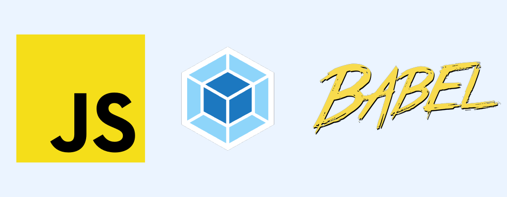

# Создание проекта на Webpack и Babel



### Описание

Установка необходимых пакетов для работы с `Webpack` и `Babel`

### Используемые команды
- `npm install --save-dev webpack webpack-cli` - установка Webpack и Webpack CLI
- `npm install --save-dev babel-loader @babel/core @babel/preset-env` - установка Babel и необходимых плагинов
- `npm install --save-dev webpack-dev-server` - установка Webpack Dev Server
- `npm install --save-dev html-webpack-plugin` - установка HTML Webpack Plugin

| **Примечание:** В команде `npm install` используется флаг `--save-dev`, чтобы сохранить пакеты в файле `package.json` в разделе `devDependencies`

**Создание необходимых папок и файлов:**
```
mkdir my-webpack-project
cd my-webpack-project
npm init -y

mkdir src
touch src/index.js
mkdir dist

npm run build <= запуск сборки проекта
npm run dev <= запуск develop проекта
```

```
npm run-script test (webpack test -- open / при нахождении тестов)
npm run-script start (webpack server --open)
```

### Структура проекта

```
my-webpack-project/
│
├── dist/                     # Сборка проекта (выходные файлы)
│
├── src/                      # Исходные файлы проекта
│   ├── assets/               # Статические файлы (изображения, шрифты и т.д.)
│   │   ├── images/           # Папка для изображений
│   │   └── fonts/            # Папка для шрифтов
│   │
│   ├── css/                  # CSS файлы
│   │   ├── main.css          # Основной CSS файл
│   │   └── styles.css        # Дополнительные стили
│   │
│   ├── js/                   # JS файлы
│   │   ├── index.js          # Основной JS файл
│   │   ├── scripts.js        # Дополнительные скрипты
│   │   ├── cars.json         # Файл с автомобилями
│   │   └── modules/          # Модули JS (если нужно)
│   │
│   ├── html/                 # HTML файлы
│   │   ├── index.html        # Главная страница
│   │   ├── contact.html      # Страница контактов
│   │   ├── gallery.html      # Галерея
│   │   ├── models.html       # Модели
│   │   └── news.html         # Новости
│   │
│   └── styles/               # Папка для SCSS или LESS (если используете)
│
├── .gitignore                # Игнорируемые файлы
├── LICENSE                   # Файл лицензии
├── package.json              # Файл зависимостей проекта
├── webpack.config.js         # Конфигурация Webpack
└── README.md                 # Описание проекта
```

```
Список страниц:
1) Главная страница (index.html) – Общая информация о сайте и популярные модели автомобилей.
2) Страница моделей (models.html) – Список моделей автомобилей.
3) Галерея (gallery.html) – Галерея с изображениями автомобилей.
4) Контакты (contact.html) – Контактная информация и форма обратной связи.
5) Новости (news.html) – Последние новости автомобильного мира.
```

### Сотрудничество
Если вы хотите внести вклад в проект, пожалуйста, откройте `issue` или создайте `pull request`

### Лицензия
**Этот проект лицензирован под MIT License** - подробности в [LICENCE](LICENSE)

### Полезные ссылки
```
[Webpack] https://webpack.js.org/
[Babel] https://babeljs.io/
```

**Автор:** Дуплей Максим Игоревич

**Дата:** 06.09.2024

**Версия:** 1.0.0
